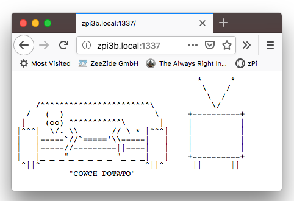
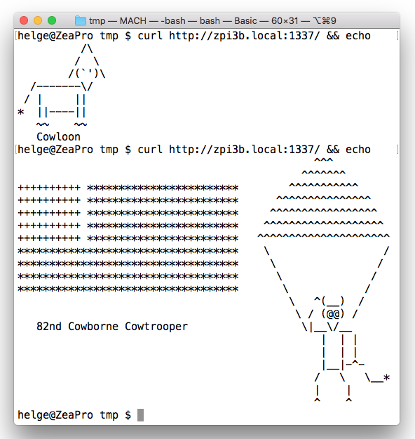

<h2>macOS -> RasPi Cross Compilation Toolchain
  
</h2>


End of April 2017
[Johannes Weiß](https://github.com/weissi)
added
[custom toolchain support](https://github.com/apple/swift-package-manager/pull/1098)
to 
[Swift Package Manager](https://github.com/apple/swift-package-manager).
Johannes also provided 
[a script](https://github.com/apple/swift-package-manager/blob/master/Utilities/build_ubuntu_cross_compilation_toolchain)
which shows how to build an Ubuntu toolchain for x86-64.
So what we did is take that script and make it produce a Swift 4.2.1 cross 
compiler toolchain for the Raspberry Pi (arm64v8) Ubuntu Bionic port.

What this is good for?
You can build Raspberry Pi Swift binaries on a Mac. Like this:
```
mkdir helloworld && cd helloworld
swift package init --type=executable
swift build --destination /tmp/cross-toolchain/arm64v8-ubuntu-bionic-destination.json
file .build/debug/helloworld
.build/debug/helloworld: ELF 64-bit LSB shared object, ARM aarch64, \
                         version 1 (SYSV), dynamically linked, \
                         interpreter /lib/ld-linux-aarch64.so.1, \
                         for GNU/Linux 3.7.0, with debug_info, not stripped
```

(We also have a toolchain kit which does the reverse, compile macOS Swift 
 binaries on a Raspberry Pi: [macos](macos/README.md))
 

## Building the ARM toolchain

What we are going to do is build a Swift 4.2 cross compilation toolchain
for ARM Ubuntu Bionic.
Here we are going to use the Swift 4.2 package manager and the Swift 4.2
compiler.

Requirements:
- Xcode 10 or later (http://developer.apple.com/)
- a Raspi 3 w/ Ubuntu Bionic (e.g. via Hypriot)

Recommended:
- [Docker for Mac](https://docs.docker.com/docker-for-mac/install/)

### Build Toolchain using Script

First download our script and make it executable:
[build_arm64v8_ubuntu_cross_compilation_toolchain](https://raw.githubusercontent.com/AlwaysRightInstitute/swift-mac2arm-x-compile-toolchain/swift-4.2-arm64v8/build_arm64v8_ubuntu_cross_compilation_toolchain),
e.g. like:

```
pushd /tmp
curl https://raw.githubusercontent.com/AlwaysRightInstitute/swift-mac2arm-x-compile-toolchain/swift-4.2-arm64v8/build_arm64v8_ubuntu_cross_compilation_toolchain \
  | sed "s/$(printf '\r')\$//" \
  > build_arm64v8_ubuntu_cross_compilation_toolchain
chmod +x build_arm64v8_ubuntu_cross_compilation_toolchain
```

Next step is to download Swift 4.2 tarballs. 
We need the macOS pkg for the host compiler and a Raspberry Pi tarball for the
Swift runtime.
On Raspi arm64v8 we are using the 4.2 build by @futurejones (thanks!):

```
pushd /tmp
curl -L -o swift-4.2.1-futurejones-ubuntu-bionic.tar.gz https://www.dropbox.com/s/fzaxi1hz18w01rz/swift-4.2.1-futurejones-ubuntu-bionic.tar.gz?dl=1
curl -o swift-4.2.1-RELEASE-osx.pkg https://swift.org/builds/swift-4.2.1-release/xcode/swift-4.2.1-RELEASE/swift-4.2.1-RELEASE-osx.pkg
```
Those are a little heavy (~500 MB), so grab a 🍺 or 🍻.
Once they are available, build the actual toolchain using the script
(it will take a minute or two to build through the dependencies):

```
pushd /tmp
./build_arm64v8_ubuntu_cross_compilation_toolchain \
  . \
  swift-4.2.1-RELEASE-osx.pkg \
  swift-4.2.1-futurejones-ubuntu-bionic.tar.gz
```

If everything worked fine, it'll end like that:
```
OK, your cross compilation toolchain for Raspi Ubuntu Bionic is now ready to be used
 - SDK: /tmp/cross-toolchain/arm64v8-ubuntu-bionic.sdk
 - toolchain: /tmp/cross-toolchain/swift.xctoolchain
 - SwiftPM destination.json: /tmp/cross-toolchain/arm64v8-ubuntu-bionic-destination.json
```


### Use the Toolchain

Lets create a simple `helloworld` tool first:

```
mkdir helloworld && cd helloworld
swift package init --type=executable
swift build --destination /tmp/cross-toolchain/arm64v8-ubuntu-bionic-destination.json
```

Which gives:
```
Compile Swift Module 'helloworld' (1 sources)
Linking ./.build/aarch64-unknown-linux/debug/helloworld
```

Check whether it actually produced an ARM binary:
```
file ./.build/aarch64-unknown-linux/debug/helloworld
./.build/aarch64-unknown-linux/debug/helloworld: \
  ELF 64-bit LSB shared object, ARM aarch64, \
  version 1 (SYSV), dynamically linked, interpreter /lib/ld-linux-aarch64.so.1, \
  for GNU/Linux 3.7.0, with debug_info, not stripped
```

Excellent! It worked. Now either copy your binary to a Raspi or test it using
QEmu as described below.

If you are not using our 
[Docker image](https://hub.docker.com/r/helje5/arm64v8-swift/),
you may need to setup the `LD_LIBRARY_PATH`, so that the dynamic linker finds
the Swift runtime. E.g. like that:

```
sudo cat > /etc/ld.so.conf.d/swift.conf <<EOF
/usr/lib/swift/linux
/usr/lib/swift/clang/lib/linux
/usr/lib/swift/pm
EOF
sudo ldconfig
```

If that didn't work, you'll see an error like:

    ./helloworld: error while loading shared libraries: libswiftCore.so: \
      cannot open shared object file: No such file or directory


## Testing builds using Docker on macOS

Docker for Mac comes with QEmu support enabled, meaning that you can run
simple ARM binaries without an actual Raspberry Pi.

```
docker run --rm --tty -i -v "$PWD/.build/debug/:/home/swift" \
  helje5/arm64v8-swift:4.2.1 \
  ./helloworld
```

This works for simple builds, more complex stuff does not run in QEmu. Use
a proper Pi for that :-)


## No README w/o 🐄🐄🐄

Lets build something very useful, an ASCII cow generator.
The snapshot's `swift package init` produces a Swift 4 setup by default.
We want to use 3.1, so we do the setup manually:

```
mkdir vaca && cd vaca
cat > Package.swift <<EOF
import PackageDescription

let package = Package(
  name: "vaca",
  dependencies: [
    .Package(url: "https://github.com/AlwaysRightInstitute/cows.git",
             majorVersion: 1, minor: 0)
  ]
)
EOF

cat > main.swift <<EOF
import cows
print(vaca())
EOF
```

Then build the thing:

```
swift build \
  --destination /tmp/cross-toolchain/arm64v8-ubuntu-bionic-destination.json
Fetching https://github.com/AlwaysRightInstitute/cows.git
Completed resolution in 1.28s
Cloning https://github.com/AlwaysRightInstitute/cows.git
Resolving https://github.com/AlwaysRightInstitute/cows.git at 1.0.4
warning: PackageDescription API v3 is deprecated and will be removed in the future; used by package(s): vaca
Compile Swift Module 'cows' (3 sources)
Compile Swift Module 'vaca' (1 sources)
Linking ./.build/aarch64-unknown-linux/debug/vaca
```

And you get the most awesome Swift tool:

```
docker run --rm --tty -i -v "$PWD/.build/debug/:/home/swift" \
           helje5/arm64v8-swift:4.2.1 ./vaca
   (___)
   (o o)
  __\_/__
 //^^*^^\
 /   *   \
/ |  *  | \
\ |=====| /
 "|_____|"
   | | |
   | | |
   |_|_|
    ^ ^
   COWNT
```

Wanna have Server Side Cows on the Pi? Try this:
[mod_swift](http://mod-swift.org/raspberrypi/).
Having the cows on your Raspi is not enough?
Get: [CodeCows](https://itunes.apple.com/de/app/codecows/id1176112058) 
for Xcode and macOS,
and [ASCII Cows](https://itunes.apple.com/de/app/ascii-cows/id1176152684)
for iOS.


## SwiftNIO Support

To build [SwiftNIO](https://github.com/apple/swift-nio) projects, 
you need to point swift-build to the right pkgconfig folder in the 
cross-toolchain, for example:
```
export PKG_CONFIG_PATH=/tmp/cross-toolchain/arm64v8-ubuntu-bionic.sdk/usr/lib/aarch64-linux-gnu/pkgconfig
```
Otherwise you'll see linker errors. swift-build will still complain that it
can't find `pkg-config`, you can ignore that:
```
warning: failed to retrieve search paths with pkg-config; maybe pkg-config is not installed
```

### Sample: Random 🐄 Micro Service

Lets build a complete SwiftNIO based random-cow microservice.
We cross-compile on the Mac and just run the finished binary on the RaspberryPi.

Create a directory for the project, add a `Package.swift` and a `main.swift`
file. 
We are again using the `cows` module, and
[MicroExpress](https://github.com/NozeIO/MicroExpress)
which is a tinsy NIO wrapper lib:
```
mkdir CowsServiceX && cd CowsServiceX
mkdir -p Sources/CowsServiceX

cat > Package.swift <<EOF
// swift-tools-version:4.2

import PackageDescription

let package = Package(
  name: "CowsServiceX",
  dependencies: [
    .package(url: "https://github.com/AlwaysRightInstitute/cows.git",
             from: "1.0.0"),
    .package(url: "https://github.com/NozeIO/MicroExpress.git",
             .branch("branches/swift-nio-lib"))
  ],
  targets: [
    .target(name: "CowsServiceX", dependencies: [ "cows", "MicroExpress" ])
  ]
)
EOF

cat > Sources/CowsServiceX/main.swift <<EOF
import MicroExpress
import cows

let app = Express()

app.get("/") { _, res, _ in
  res.send(cows.vaca())
}

app.listen(1337, "0.0.0.0")
EOF
```

To compile this using the toolchain:
```shell
$ export PKG_CONFIG_PATH=/tmp/cross-toolchain/arm64v8-ubuntu-bionic.sdk/usr/lib/aarch64-linux-gnu/pkgconfig
$ swift build --destination /tmp/cross-toolchain/arm64v8-ubuntu-bionic-destination.json
Fetching https://github.com/AlwaysRightInstitute/cows.git
Fetching https://github.com/NozeIO/MicroExpress.git
Fetching https://github.com/apple/swift-nio.git
Fetching https://github.com/AlwaysRightInstitute/mustache.git
Fetching https://github.com/apple/swift-nio-zlib-support.git
Completed resolution in 10.79s
Cloning https://github.com/AlwaysRightInstitute/cows.git
Resolving https://github.com/AlwaysRightInstitute/cows.git at 1.0.4
Cloning https://github.com/apple/swift-nio-zlib-support.git
Resolving https://github.com/apple/swift-nio-zlib-support.git at 1.0.0
Cloning https://github.com/apple/swift-nio.git
Resolving https://github.com/apple/swift-nio.git at 1.12.0
Cloning https://github.com/NozeIO/MicroExpress.git
Resolving https://github.com/NozeIO/MicroExpress.git at branches/swift-nio-lib
Cloning https://github.com/AlwaysRightInstitute/mustache.git
Resolving https://github.com/AlwaysRightInstitute/mustache.git at 0.5.6
warning: failed to retrieve search paths with pkg-config; maybe pkg-config is not installed
Compile CNIOLinux shim.c
Compile CNIOSHA1 c_nio_sha1.c
Compile CNIOLinux ifaddrs-android.c
Compile CNIOZlib empty.c
Compile CNIOHTTPParser c_nio_http_parser.c
Compile CNIODarwin shim.c
Compile CNIOAtomics src/c-atomics.c
Compile Swift Module 'mustache' (6 sources)
Compile Swift Module 'cows' (3 sources)
Compile Swift Module 'NIOPriorityQueue' (2 sources)
Compile Swift Module 'NIOConcurrencyHelpers' (2 sources)
Compile Swift Module 'NIO' (55 sources)
Compile Swift Module 'NIOHTTP1' (9 sources)
Compile Swift Module 'MicroExpress' (8 sources)
Compile Swift Module 'CowsServiceX' (1 sources)
Linking ./.build/aarch64-unknown-linux/debug/CowsServiceX
$ file ./.build/aarch64-unknown-linux/debug/CowsServiceX
./.build/aarch64-unknown-linux/debug/CowsServiceX: \
  ELF 64-bit LSB shared object, ARM aarch64, version 1 (SYSV), \
  dynamically linked, interpreter /lib/ld-linux-aarch64.so.1, \
  for GNU/Linux 3.7.0, with debug_info, not stripped
```

You can then `scp` this to your Raspi, e.g. we use (in combination with 
docker-machine):
```shell
$ eval $(docker-machine env zpi3b)
$ scp ./.build/aarch64-unknown-linux/debug/CowsServiceX zpi3b:/tmp/
$ docker run --rm -d -v "/tmp:/tmp" \
         --name CowsServiceX \
         -p 1337:1337 \
         helje5/arm64v8-swift:4.2.1 \
         /tmp/CowsServiceX
Server running on: [IPv4]0.0.0.0/0.0.0.0:1337
```

Hit it up at: [http://zpi3b.local:1337/](http://zpi3b.local:1337/) and you
get:



Reload to get a new random cow. It is a proper microservice, so test it out
using curl:




### SwiftXcode

All this works as well from within 
[SwiftXcode](https://swiftxcode.github.io)! 
Just create a new SwiftXcode NIO project, develop your app on macOS using
the default template.

To deploy, create an aggregate target with a script build phase that
invokes `swift build` and copies the result to your Raspi (or directly
builds on NFS).


## Notes of interest

- Ubuntu system headers and such for the toolchain are directly pulled
  from the Debian packages (which are retrieved from the Ubuntu repository)
- The cross compiler is just a regular clang/swiftc provided as part of
  a macOS toolchain. Yes, clang/swift are always setup as cross compilers
  and can produce binaries for all supported targets! (didn't know that)
- To trace filesystem calls on macOS you can use `fs_usage`, e.g.:
  `sudo fs_usage -w -f pathname swift` (I only knew `strace` ;-)
- `swift build --static-swift-stdlib` does not currently work, but that
  is an easy fix if desired (`static-stdlib-args.lnk` needs to be fixed to
  point to the right location)

Links:

- [SwiftyLinkerKit](https://github.com/SwiftyLinkerKit/SwiftyLinkerKit)
- [LinkerKitIRCBot](https://github.com/SwiftyLinkerKit/LinkerKitIRCBot)
- [MicroExpress](https://github.com/NozeIO/MicroExpress)
- [SwiftNIO](https://github.com/apple/swift-nio)
- [SwiftXcode](https://swiftxcode.github.io)
- [Hypriot](https://blog.hypriot.com) - [64bit images](https://github.com/DieterReuter/image-builder-rpi64/releases)
- DockerHub [helje5/arm64v8-swift](https://cloud.docker.com/u/helje5/repository/docker/helje5/arm64v8-swift) image
- DockerHub [helje5/arm64v8-swift-dev](https://cloud.docker.com/u/helje5/repository/docker/helje5/arm64v8-swift-dev) image (w/o Emacs etc)
- [SwiftNIO on Raspi](https://helgehess.eu/SwiftNIO-Raspi-Screens.pdf) presentation PDF at [ServerSide.swift Conf](https://www.serversideswift.info)

### Who

Brought to you by
[The Always Right Institute](http://www.alwaysrightinstitute.com)
and
[ZeeZide](http://zeezide.de).
We like 
[feedback](https://twitter.com/ar_institute), 
GitHub stars, 
cool [contract work](http://zeezide.com/en/services/services.html),
presumably any form of praise you can think of.
We don't like people who are wrong.

There is the [swift-arm](https://slackpass.io/swift-arm) Slack channel
if you have questions about running Swift on ARM/Raspberry Pi.

<table width="100%" border="0">
  <tr>
    <td align="center" width="20%">
      <a href="http://apacheexpress.io"
        ></a>
    	<br />
    	ApacheExpress
    </td>
    <td align="center" width="20%">
      <a href="http://mod-swift.org"
        ></a>
    	<br />
    	mod_swift
    </td>
    <td align="center" width="20%">
      <a href="http://zeeql.io"
        ></a>
      <br />
      ZeeQL
    </td>
    <td align="center" width="20%">
      <a href="http://noze.io"
        ></a>
      <br />
      Noze.io
    </td>
    <td align="center" width="20%">
      <a href="https://github.com/ZeeZide/UXKit"
        ></a>
      <br />
      UXKit
    </td>
  </tr>
</table>
